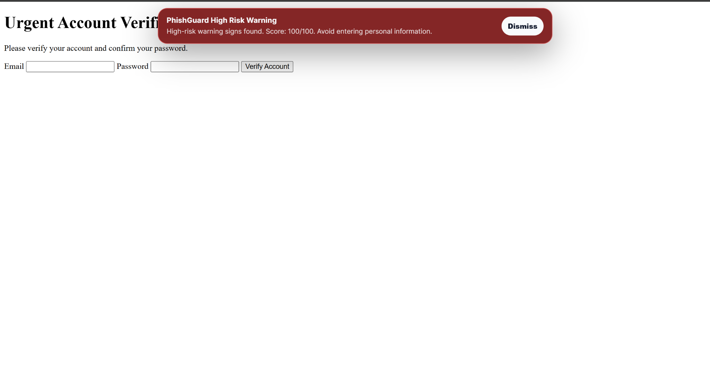

# PhishGuard Browser Threat & Link Risk Analyzer

PhishGuard is a defensive Chrome/Edge browser extension that analyzes the current tab URL, scores phishing risk, explains warning signs, and helps users practice safer link decisions.

This project upgrades the original `Browser-Phishing-Risk-Analyzer` into a polished browser security portfolio project with a Manifest V3 extension, popup dashboard, current-tab scanning, manual URL scanning, page signal review, scan history, JSON report export, and CI validation.

## Project Preview

<p>
  
</p>

## Overview

PhishGuard is designed to feel like a lightweight browser security tool for students, staff, and support teams. It does not attack websites or bypass protections. It reviews visible URL and page signals, then explains possible risks in plain language.

## Real-World Use Case

Users often receive links through email, chat, social media, documents, or classroom platforms. Before trusting a link, they need to know:

- Does the URL use HTTPS?
- Is the domain strange or misleading?
- Is a URL shortener hiding the destination?
- Does the link use urgent or account-warning wording?
- Does the page ask for login details?
- Does the link imitate a trusted brand?
- Can the user export a simple report for awareness training?

PhishGuard turns those questions into a browser workflow.

## Safe Demo Boundary

PhishGuard is defensive and educational. It is intended for:

- Browser security awareness
- Student ICT demonstrations
- Defensive URL review
- Portfolio demonstrations
- Helpdesk-style phishing triage examples

It should not be used to generate phishing links, bypass controls, or test systems without permission.

## Automatic Protection Behavior

PhishGuard now runs an automatic defensive scan when a page loads.

Automatic behavior includes:

- Current-page URL analysis
- Page signal collection
- Extension badge status
- Green `OK` badge for low-risk pages
- Yellow `!` badge for watch-level pages
- Red `!!` badge for high-risk pages
- On-page warning banner for watch-level and high-risk pages
- Full report available by clicking the extension icon

The popup remains the detailed review panel. The banner gives the user an immediate warning without requiring them to manually open the extension first.

## Key Features

- Chrome/Edge Manifest V3 extension
- Automatic current-page scanning
- Current-tab URL scanning
- Manual URL scanner
- Phishing risk score
- Low / Watch Closely / High Risk labels
- Explainable warning cards
- Extension badge risk status
- On-page warning banner for suspicious pages
- Page signal collection
- Password field and login-signal awareness
- Scan history
- Clear history control
- Export JSON report
- Student safety reminder
- CI validation for manifest and JavaScript files

## How To Use Locally In Chrome

1. Open Chrome.
2. Go to:

```text
chrome://extensions


